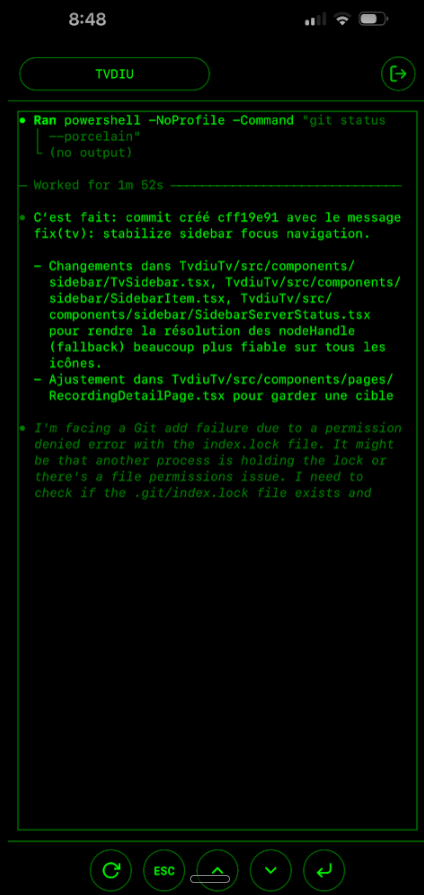
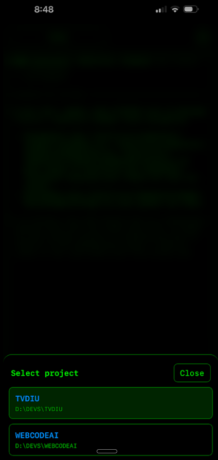

# PocketCodex

  
*Your AI-Powered Pocket Development Environment*

PocketCodex is a lightweight, web-based Integrated Development Environment (IDE) designed to run on your local machine and be accessed from anywhere—including your mobile device or tablet. It combines a powerful Node.js backend with a responsive React frontend to give you full control over your terminal, files, and AI-assisted workflows on the go.

## 🚀 Features

- **Full Terminal Access**: A fully functional, persistent terminal right in your browser (xterm.js).
- **AI-Native Workflow**: Built from the ground up to integrate seamlessly with **Codex** for intelligent code generation and assistance.
- **Mobile-First Design**: Optimized touch controls and layout for coding on tablets and phones.
- **Secure Tunneling**: compatible with Cloudflare Tunnel (or ngrok) for secure remote access.
- **Workspace Management**: Switch contexts and projects easily.

## 📸 Screenshots

<p align="center">
  
  
</p>

## ⚠️ Current Limitations

- **Operating System**: Currently, only **Windows** is supported.
- **AI Integration**: AI capabilities are currently powered exclusively by **Codex**.

## 🛠 Tech Stack

- **Backend**: Node.js 18+, Express.js, TypeScript, node-pty, WebSocket.
- **Frontend**: React 18, Vite, TypeScript, TailwindCSS (styled components), xterm.js.
- **Communication**: WebSocket for real-time terminal streaming and state synchronization.

## 🏁 Getting Started

### Prerequisites

- **Node.js**: Version 18 or higher (using `npm`).
- **Git**: For version control.

### Installation

1. **Clone the repository**
   ```bash
   git clone https://github.com/mhamel/PocketCodex.git
   cd PocketCodex
   ```

2. **Backend Setup**
   Navigate to the backend directory and install dependencies:
   ```bash
   cd backend-node
   npm install
   ```

3. **Frontend Setup**
   Open a new terminal, navigate to the frontend directory, and install dependencies:
   ```bash
   cd frontend
   npm install
   ```

## 🔐 Configuration & Security

### User Credentials
Authentication is managed via a simple JSON file located at:
`backend-node/data/users.json`

**⚠️ IMPORTANT:**
- The default credentials are placeholders.
- **You MUST change the username and password** in this file before deploying or exposing the application.
- Currently, credentials are stored in plain text (improvements planned).

## ⚡ Usage

### Running Locally

You need to run both the backend and frontend servers.

**1. Start the Backend API** (Port 8000 by default)
From the `backend-node` directory:
```bash
npm run dev
```

**2. Start the Frontend Dev Server**
From the `frontend` directory:
```bash
npm run dev
```
Access the application at `http://localhost:9999`.

### Remote Access (Optional)

To access PocketCodex from your mobile device, we recommend using a secure tunnel like Cloudflare Tunnel.

```bash
cloudflared tunnel --url http://localhost:8000
```
*Note: Ensure your frontend is configured to build/proxy correctly to the backend port if serving purely static files, or use the dev server's network exposure options.*

## 🤝 Contributing

Contributions are welcome! Please feel free to submit a Pull Request.

1. Fork the project
2. Create your feature branch (`git checkout -b feature/AmazingFeature`)
3. Commit your changes (`git commit -m 'Add some AmazingFeature'`)
4. Push to the branch (`git push origin feature/AmazingFeature`)
5. Open a Pull Request

## 📄 License

Distributed under the MIT License. See `LICENSE` for more information.
